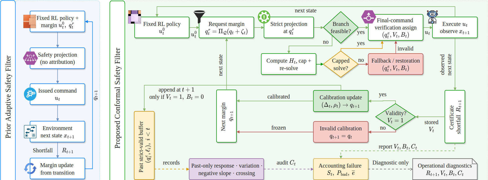
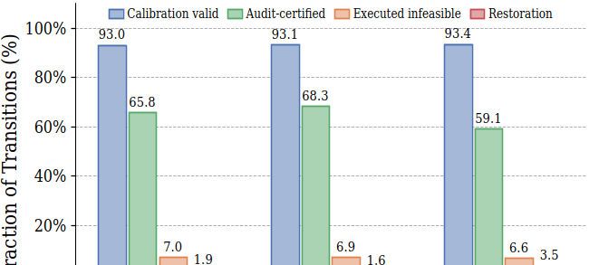
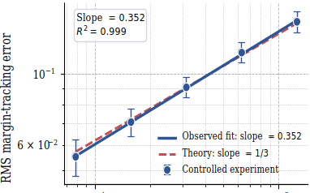
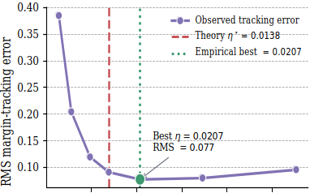

# Conformal Safety Filtering under Enforcement Mismatch

**E-COCSF: an enforcement-aware, policy-agnostic runtime safety layer for fixed reinforcement-learning policies**

> **Paper title:** *Conformal Safety Filtering under Enforcement Mismatch*  
> **Method:** E-COCSF  
> **Evaluation:** controlled endogenous process, CARLA 0.9.15, and Safety-Gymnasium `SafetyPointGoal2-v0`

E-COCSF adapts a safety margin only from transitions for which the enforced margin is verifiably attributable to the final command. When the requested margin exceeds modeled control authority, the filter estimates available headroom, conservatively caps the request, re-solves the projection, and verifies the final command. Restored, fallback, solver-failed, or downstream-modified transitions remain visible in deployment statistics but are excluded from calibration updates.

The implementation wraps a fixed SAC, PPO, or other black-box policy. It does not require retraining the policy to change the safety-filter logic.

---

## Methodology

<p align="center">
  
</p>

The figure contrasts a conventional adaptive safety filter with the proposed enforcement-aware loop. E-COCSF separates the **requested margin** from the **verified enforced margin** and records three transition states: strict-valid, capped-valid, and invalid.

1. A fixed policy proposes the nominal action `u_t^0`.
2. A bounded probe forms the requested margin `q_t^r`, and the filter attempts strict projection.
3. If strict projection fails, a bounded search estimates model-relative safety headroom. The request may be conservatively capped and re-solved.
4. The final command is reverified after downstream processing. Calibration proceeds only when the enforced margin is attributable (`V_t = 1`); otherwise the margin is frozen.
5. A past-only audit uses earlier strict-valid margin/loss records to diagnose excitation, negative local sensitivity, and an in-range target crossing. Capped, invalid, and audit-unsupported operation is reported explicitly.

For an enforcement-valid transition, the certificate shortfall is

$$
R_{t+1}=\left[\widehat h_t(x_t,u_t)-h_t(x_{t+1})\right]_+,
$$

and the margin update uses the bounded ramp loss relative to the verified enforced margin `q_t^e`. Invalid transitions do not evaluate the calibration loss and satisfy `q_{t+1}=q_t`.

### Core design principles

- **Enforced-margin attribution:** update only from the command semantics that actually generated the transition.
- **Verified headroom capping:** recover attributable transitions when the original request is numerically unenforceable.
- **Conditional anti-windup:** prevent high-loss capped transitions from pulling the internal margin downward.
- **Past-only response audit:** prevent the current residual from retrospectively supporting its own transition.
- **Failure-explicit accounting:** report capped, invalid, restored, and audit-unsupported operation rather than hiding it inside a conditional metric.

---

## Repository structure

```text
E-COCSF-main/
├── README.md
├── code/
│   ├── ECLCS.py
│   ├── carla_train_eval.py
│   ├── safety_gym_env.py
│   ├── safety_gym_sac_train.py
│   └── safety_gym_train_eval.py
├── figs/
│   └── e-cosf.png
├── graphs/
│   ├── cube_root_scaling.png
│   ├── gain_tradeoff.png
│   ├── runtime_diagnostics.png
│   ├── seed_robustness.png
│   └── validity_audit.png
└── results/
    ├── benchmark_aggregate_results.csv
    ├── benchmark_calibration_accounting.csv
    ├── benchmark_episode_results.csv
    ├── benchmark_paired_method_deltas.csv
    ├── benchmark_results.json
    ├── benchmark_steps.jsonl.gz
    ├── console.log
    └── manifest.json
```

---

## Code tour

### `code/ECLCS.py` — core E-COCSF implementation

This is the main runtime-filter module. The filename is retained for compatibility with the experiment scripts; it implements the paper's E-COCSF method.

- `ECLCSConfig`: calibration, projection, capping, anti-windup, audit, action-limit, and logging configuration.
- `FilterDecision` and `TransitionUpdate`: per-step enforcement decisions and post-transition calibration records.
- `ClosedLoopCalibrationAudit`: kernel-weighted, past-only local response audit.
- `EndogenousClosedLoopConformalSafetyFilter`: requested-margin projection, final-command verification, headroom capping, invalid-transition freezing, residual processing, and metric accounting.
- `AutonomousDrivingBarrierModel` and `ACCBarrierModel`: barrier interfaces for driving and controlled experiments.
- `SelfCorrectingResidualProcess`: controlled nonstationary process used for the gain/drift study.
- `run_scaling_study`: cube-root tracking and gain-sweep experiment.
- `run_carla` / `run_carla_drift_sweep`: direct CARLA runtime-filter studies.

### `code/safety_gym_env.py` — Safety-Gymnasium adapter and barrier model

- Converts the native observation and privileged simulator geometry into the filter state.
- Implements `PointGoalBarrierModel`, including one-step prediction and component-wise barrier evaluation.
- Provides `SafetyPointGoalAdapter` for environment resets, stepping, action noise, object geometry, and transition diagnostics.
- Loads the frozen affine dynamics model used by the Safety-Gymnasium evaluation.

### `code/safety_gym_sac_train.py` — nominal SAC training

Trains the fixed SAC policy using only the standard environment observation. Privileged geometry remains inside the runtime safety layer so the policy information set is unchanged during evaluation.

### `code/safety_gym_train_eval.py` — PPO, dynamics identification, and benchmark runner

This script provides four subcommands:

- `train`: train a nominal PPO policy.
- `identify`: fit the frozen Point dynamics model from disjoint collision-free data.
- `eval`: evaluate PPO or SAC checkpoints with E-COCSF and baseline margin mechanisms under paired noise conditions.
- `smoke`: verify environment, geometry, barrier, and adapter integration.

It writes episode-level, aggregate, calibration-accounting, paired-delta, manifest, and optional compressed step-level outputs.

### `code/carla_train_eval.py` — CARLA policy training and guarded evaluation

- Trains a compact black-box SAC driving policy.
- Evaluates the fixed checkpoint across CARLA towns with E-COCSF.
- Handles route planning, command scaling, traffic-light logic, predictive collision guards, final-command attribution, and cross-town result collection.
- Keeps the nominal policy separate from the runtime filter, matching the policy-agnostic experimental design.

### `results/` — released evaluation artifacts

- `benchmark_aggregate_results.csv`: aggregate performance and safety metrics by condition.
- `benchmark_calibration_accounting.csv`: strict-valid, capped-valid, invalid, audit-support, soft-loss, and hard-exceedance accounting.
- `benchmark_episode_results.csv`: per-episode outcomes.
- `benchmark_paired_method_deltas.csv`: paired differences between evaluated methods.
- `benchmark_results.json`: complete structured benchmark summary.
- `benchmark_steps.jsonl.gz`: compressed transition-level logs.
- `manifest.json`: command, package versions, hardware, arguments, and source/checkpoint hashes for the released run.

---

## Installation

The released Safety-Gymnasium manifest records Python 3.10, NumPy 1.23.5, Gymnasium 0.28.1, MuJoCo 2.3.3, Safety-Gymnasium 1.0.0, and PyTorch 2.12.1. Install a PyTorch build compatible with the local CPU/CUDA platform.

```bash
conda create -n ecocsf python=3.10 -y
conda activate ecocsf

pip install numpy==1.23.5 gymnasium==0.28.1 mujoco==2.3.3 safety-gymnasium==1.0.0
# Install the appropriate PyTorch wheel separately for your platform.
```

CARLA experiments additionally require a running CARLA 0.9.15 server and its matching Python API.

---

## Quick start

Run commands from the `code/` directory so local imports resolve correctly.

### 1. Verify Safety-Gymnasium integration

```bash
cd code
python safety_gym_train_eval.py smoke --env_id SafetyPointGoal2-v0 --steps 100
```

### 2. Reproduce the controlled scaling study

```bash
python ECLCS.py --scaling --out_dir ../runs/controlled_scaling
```

This experiment isolates the response assumptions and produces the cube-root drift-scaling and gain-tradeoff results.

### 3. Train fixed Safety-Gymnasium policies

PPO:

```bash
python safety_gym_train_eval.py train \
  --device auto \
  --seed 42 \
  --total_steps 500000 \
  --out_dir ../runs/pointgoal2_ppo_seed42
```

SAC:

```bash
python safety_gym_sac_train.py \
  --device auto \
  --seed 42 \
  --total_steps 500000 \
  --out_dir ../runs/pointgoal2_sac_seed42
```

### 4. Identify the frozen Point dynamics model

```bash
python safety_gym_train_eval.py identify \
  --seed 10042 \
  --out_model ../runs/dynamics_seed10042.json
```

### 5. Evaluate E-COCSF under actuator-noise shift

```bash
python safety_gym_train_eval.py eval \
  --checkpoint ../runs/pointgoal2_sac_seed42/sac_policy_final.pt \
  --dynamics_model ../runs/dynamics_seed10042.json \
  --device auto \
  --seed 40042 \
  --episodes 50 \
  --max_steps 1000 \
  --noise_levels 0,0.05,0.10,0.20 \
  --methods ecocsf \
  --epsilon 0.10 \
  --eta 0.001 \
  --q_init 0.017 \
  --q_max 0.05 \
  --ramp_tau 0.001 \
  --zeta_max 0.001 \
  --probe_probability 0.20 \
  --barrier_alpha 0.70 \
  --headroom_cap_delta 0.0001 \
  --anti_windup_gamma 0.01 \
  --restoration_grid_points 21 \
  --residual_action commanded \
  --out_dir ../runs/safetygym_ecocsf
```

The evaluator accepts both PPO checkpoints produced by `safety_gym_train_eval.py` and SAC checkpoints produced by `safety_gym_sac_train.py`.

### 6. CARLA training and evaluation

Start CARLA 0.9.15, then train a fixed SAC checkpoint and evaluate it with the runtime filter. The paper protocol trains in Town10HD and evaluates 20 guarded routes each in Town02, Town05, and Town10HD.

```bash
python carla_train_eval.py --train \
  --carla_port 2200 \
  --train_town Town10HD \
  --total_steps 250000 \
  --out_dir ../runs/carla_sac_town10hd
```

```bash
python carla_train_eval.py --eval \
  --carla_port 2200 \
  --checkpoint ../runs/carla_sac_town10hd/policy_final.pt \
  --eval_towns Town02,Town05,Town10HD \
  --episodes 20 \
  --out_dir ../runs/carla_cross_town
```

Use `python <script>.py --help` for the complete set of environment, audit, projection, guard, and ablation options.

---

## Result graphs

### CARLA enforcement and audit diagnostics

<p align="center">
  
</p>

Across the evaluated towns, most transitions preserve attributable final-command semantics. The graph separately exposes audit support, strict infeasibility, and restoration instead of treating all observed transitions as valid calibration evidence.

### Controlled root-drift scaling and gain tradeoff

<p align="center">
  
  
</p>

The fitted log-log tracking exponent is `0.352` with `R² = 0.999`, close to the predicted cube-root exponent `1/3`. The gain sweep is U-shaped: the theory-derived `eta* = 0.0138` lies near the empirical grid minimum `0.0207`.

---

## Result tables

### CARLA cross-town evaluation

| Town | Return ↑ | Route success | Barrier violation ↓ | Valid-transition hard exceedance `e_V` ↓ |
|---|---:|---:|---:|---:|
| Town02 | 3917 ± 639 | 100% | 0.35% | 1.18% |
| Town05 | 3815 ± 788 | 100% | 0.58% | 1.08% |
| Town10HD | 3581 ± 848 | 100% | 1.37% | 1.58% |
| **Overall** | **3771** | **100%** | **0.77%** | **1.28%** |

All 60 guarded routes completed in the reported simulation. `e_V` is conditioned on transitions with an attributable numerical margin, while barrier violations are measured over all transitions; the two quantities answer different questions.

### Safety-Gymnasium pooled results

Each policy contributes 200,000 transitions pooled over actuator-noise levels `0`, `0.05`, `0.10`, and `0.20`.

| Metric | SAC | PPO |
|---|---:|---:|
| Valid-transition soft loss `l_V` ↓ | 0.1056 | **0.1038** |
| Valid-transition hard exceedance `e_V` ↓ | **8.67%** | 8.88% |
| Enforcement validity `p_V` ↑ | 73.78% | **83.57%** |
| Strict-valid soft loss ↓ | 0.0898 | **0.0892** |
| Capped-valid soft loss ↓ | 0.2648 | **0.2324** |
| Barrier violation ↓ | 17.78% | **14.57%** |
| Geometry violation ↓ | 9.19% | **7.84%** |

Both fixed policy interfaces remain below 10% validity-conditioned hard exceedance. The capped-valid branch is substantially more difficult than the strict-valid branch, which motivates reporting it separately rather than averaging away limited control authority.

### Strict-failure ablation

Fixed SAC, actuator noise `0.10`, and 50 paired 1000-step episodes:

| Variant | Goals ↑ | Cost ↓ | Barrier violation ↓ | `e_V` ↓ | Valid ↑ | Invalid ↓ | Capped | Audit |
|---|---:|---:|---:|---:|---:|---:|---:|---:|
| Full E-COCSF | 3.9 ± 2.3 | **111.1 ± 86.0** | **14.7 ± 9.2%** | 5.8 ± 3.5% | **81.1 ± 15.6%** | **18.9 ± 15.6%** | 10.4 ± 5.0% | 19.5 ± 18.6% |
| No cap | 4.9 ± 3.1 | 114.9 ± 92.3 | 26.5 ± 12.0% | **1.8 ± 1.2%** | 51.0 ± 26.1% | 49.0 ± 26.1% | 0% | 13.9 ± 13.5% |
| No recovery | **7.6 ± 2.4** | 208.5 ± 107.8 | 23.9 ± 11.0% | 2.2 ± 1.0% | 70.1 ± 12.5% | 29.9 ± 12.5% | 0% | 15.5 ± 10.0% |

Removing capping sharply reduces validity and increases barrier violation. The lower conditional exceedance of the ablations is not evidence of safer deployment: their valid subsets are smaller because more transitions become unattributable.

---

## Metrics and interpretation

| Metric | Interpretation |
|---|---|
| `valid_soft_loss` | Mean bounded ramp loss over enforcement-valid transitions. |
| `valid_hard_exceedance_rate` | Fraction of valid transitions with `R_{t+1} > q_t^e`. |
| `validity` | Fraction of all transitions with an attributable verified margin. |
| `verified_capped_rate` | Fraction of all transitions recovered through capped re-solving and final-command verification. |
| `invalid_rate` | Fraction excluded from calibration because margin attribution failed. |
| `operational_support_rate` | Fraction passing the prospective past-only response audit. |
| `barrier_violation` | Failure of the implemented predictive barrier over all transitions. |
| `geometry_violation` | Geometry-only safety-set violation over all transitions. |

Do not interpret valid-transition exceedance as collision probability or as an unconditional all-step guarantee. The failure-explicit analysis charges unsupported operation, while the released experiments report observable validity, capping, invalidity, restoration, and audit support separately.

---

## Reproducibility notes

- The controlled process runs for 20,000 steps with three seeds per drift level.
- CARLA uses a fixed SAC policy trained for 250,000 steps in Town10HD and evaluates 20 routes per town.
- Safety-Gymnasium uses fixed SAC and PPO checkpoints trained for 500,000 steps with seed 42.
- Each Safety-Gymnasium checkpoint is evaluated for 50 episodes of 1000 steps at four actuator-noise levels.
- The released `results/manifest.json` records the exact command, arguments, package versions, hardware, checkpoint hash, and source hashes for the included run.
- The experiments support the reported simulation behavior; they do not establish physical-deployment safety or robustness across independently trained checkpoints.
